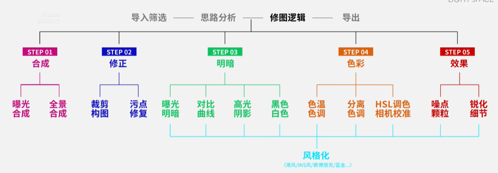
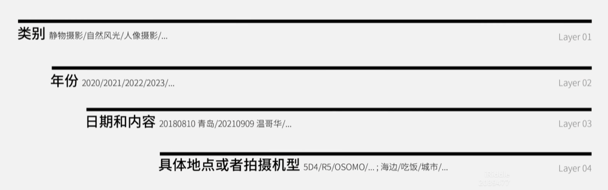
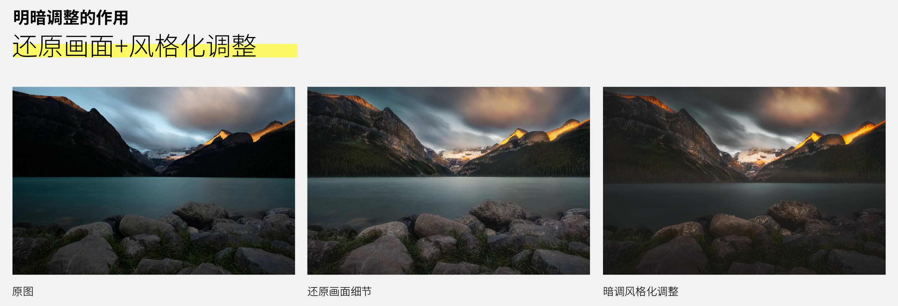
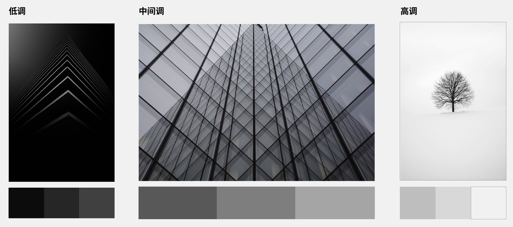
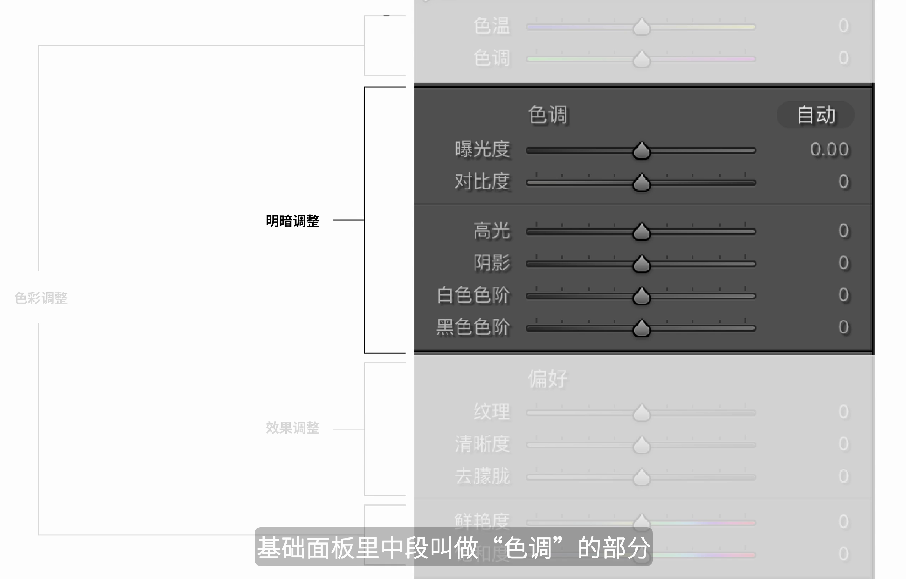
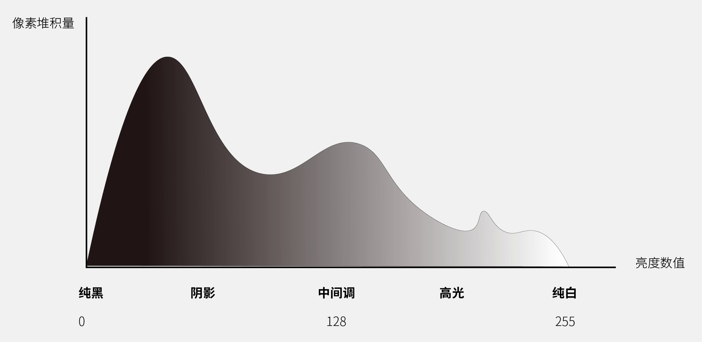
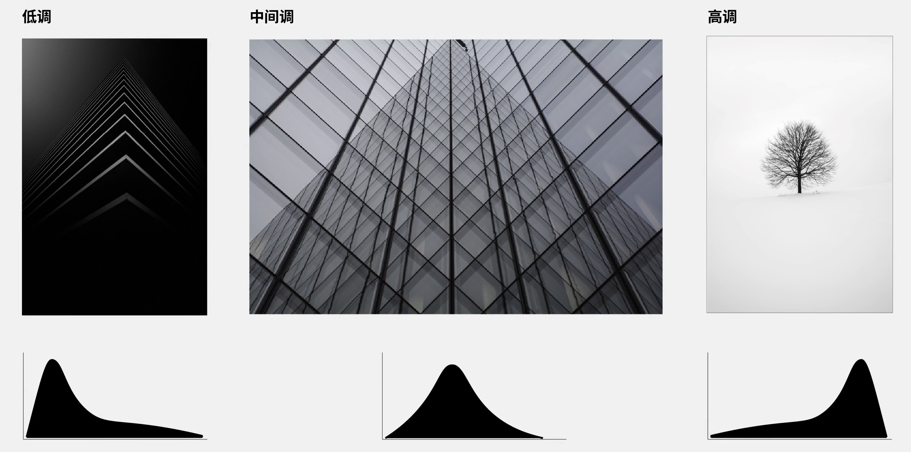
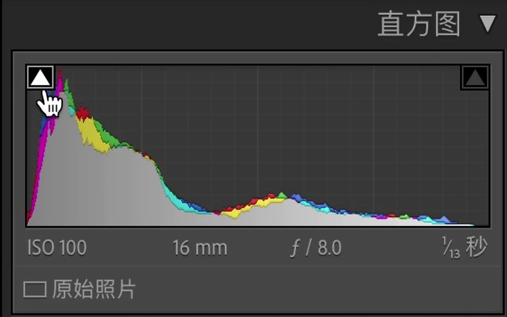
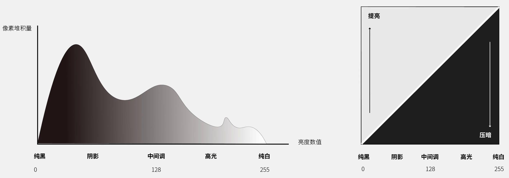
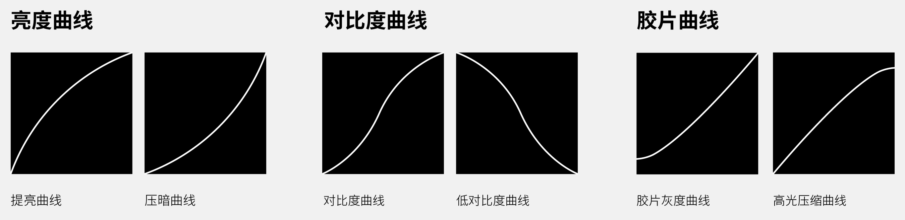

# 摄影后期调色：带你玩转Lightroom

先导课：称霸朋友圈的大片是怎么调出来的

## PART I 基础理论

### 1.奠定基础，认识LR界面及基础操作

> 打基础，讲解修图的底层逻辑及原理。

#### 什么是原片，怎么样才算是没修过的原图

RAW格式是调整空间最大的照片格式，几乎包含了拍摄的全部信息。

不同的厂家有不同的命名规则：

#### 修图的作用

1. 去瑕疵，杂物去除（CH3）

2. 调整画面明暗色彩（CH4-5）

3. 强调画面，引导观众（核心要点，精髓所在，Ch6-）

4. 弥补相机缺陷（如曝光合成，CH8）

5. 艺术/风格化调整

#### 修图软件

- Lightroom Classic

- Nik Collection（调色插件）

- Topaz Denoise AI（降噪，画面修复）

##### Lightroom Classic

上中下是固定区域，不会改变；左右是功能区域（可以点击小箭头来显示隐藏）

> 可以查看 PDF 指南

设计是按照工作流来的，但是常用的只有图库和修改照片。后面的几个功能区不是太好用。

其他环节有更好的替代：

- 画册：InDesign

- 网站：Mix、WordPress

### 2.科学修图，掌握正确的修图流程及照片管理方式

#### 修图流程

在不熟悉修图操作的时候，帮助大家有框架性的内容，防止遗忘掉一些重要操作。

在不知道怎么修的时候，遵循修图步骤，可以有初始的思路，让照片完成度更高。

> 照片管理-修图-导出

Step0：导入筛选，标记出需要修的照片（4星或5星）

Step1：原图分析，确定思路

Step2：基础修复（基础矫正，瑕疵修复）

Step3：明暗色彩

Step4：添加效果

> 修瑕疵、引导观众、调明暗、风格化

#### 照片文件管理

LRC的照片数据库和原始文件结构没有必然关系，我们对照片调整的信息，只会存在于LRC的照片数据库中，不会在层级文件夹中，除非保存元数据信息到文件。

#### LRC操作

##### LRC目录使用方式

1. 单一目录：所有照片都导入一个目录

2. 项目目录：每次拍摄项目新建目录（更常用）

   > 这里说的实际是每次都是一个小目录，每个小目录都建立一个LRC目录？
   >
   > 这样的话如何统一查看所有文件？

##### 导入操作

1. 建立目录：如在素材文件夹中

2. 导入：如果是外置硬盘，可以选择：文件处理-构建智能预览

##### 对照片筛选分类

使用星级：

- 一星：初筛

- 二星：进一步筛选

- 三到五星：三星（可以发朋友圈）、四星（进入作品集）、五星（可以投稿参赛）

色标：

- 红色：标记需要合成的照片序列

旗标

关键字面板可以精确标记：

- 写上合照、朋友名字等

使用LRC筛选器和收藏夹进行精确定位查找及保存

智能收藏夹：按条件筛选，会动态更新，是虚拟文件夹

### 3.修复瑕疵，拯救照片的暗角和歪斜

#### 瑕疵修复及透视矫正

##### 污点修复

污点修复：羽化可以让过度更自然

还可以拖拽修复采样点来更换不同区域采样修复。

> 为什么现在的逻辑都偏向仿制图章？之前用ps不是都可以AI消去的吗？
>
> 试了不好用

如何观察不太明显的脏点？

曲线面板，选择点曲线，建立类似正弦函数的曲线（污点观察曲线），用完记得复原

> 点曲线是白色的圆圈
> 还原可以把曲线右键删除，或者关掉曲线

##### 透视及如何矫正

拍建筑的时候会发现有的楼向后歪斜，就像要倒了一样—透视没有被矫正

透视与消失点

透视类型

- 一点透视：横平竖直、只有一个消失点

- 两点透视：竖线垂直、有两个消失点（比如房屋，又叫成角透视）

- 三点透视：竖直线也倾斜、有三个消失点（倾倒的高楼，要避免）

变换面板

- 自动/引导：都可以使用（优先用智能）

- 水平：有地平线或者水平面的图

- 垂直：两点或者三点透视，如高楼想矫回两点透视，针对竖直线矫正

- 完全：对于最终效果是一点透视，横平竖直

自动不行的话，选择引导，手动画引导线。可以画4条线，但是至少有2条。

- 两点透视画竖线，对于广角镜头，越边缘畸变越明显，可以选择边缘画参考线。

- 一点透视：画两条，水平和竖直，不行的话画4条线

出现白边可以点击锁定裁剪

##### 裁剪

如何利用裁剪重新构图

一些原则，如三分法、中心线

Step1：根据风格确认画幅比例，如电影感、模拟复古胶片

Step2：确认画面主体元素（通过主体crop-in的方式让主体更突出：把主体放在三分线上或中线上）

Step3：去掉无关因素

> 前期能处理好的永远不要后期修补

##### 配置文件矫正

镜头矫正面板

1. 色差：紫边、绿边、老镜头明显

2. 暗礁：四周暗、中心亮、广角比较明显

3. 扭曲度：边缘弯曲的畸变、广角桶形畸变、长焦枕形畸变

操作：勾选移除色差、启用配置文件矫正

如果不想矫正暗角，可以把数量滑杆拉到0

自动效果不好，只能手动拉滑杆

### 4.明暗调整，优化照片光影对比

#### 4.1 明暗调整的作用

明暗调整的作用：还原画面+风格化调整

- 还原画面：还原画面到正常的曝光，如看清高光、阴影的细节等。属于中规中矩技术向调整，常见于商业客片或者旅行记录照上。
- 风格化：根据大家当时的想法和感受去调整，强调个性特色。需要了解技术向的知识，也需要美学上的认知，比如是影调导致的画面风格倾向。

#### 4.2 三大影调

影调：

- 增加曝光：小清新（高调）
- 减少曝光：情绪片
  - 雾气蒙蒙（中间调）
  - 压抑阴沉（低调）

#### 4.3 基础明暗调整工具

LRC面板介绍（明暗调整滑块）

基础面板里叫做色调的部分，实际上就是明暗基础调整

> 重构LRC的面板：LRC的面板和名称容易误导大家

明暗基础调整涉及的部分（曝光和对比度比较单独，其他可以成对记忆）：

- 曝光：影响画面整体亮度（影响亮中暗全部，当时对中间区域影响最大，对亮部和暗部有一定程度保护，因此可以对照片定调-做出照片倾向的基调/影调），优先调整

- 对比度：控制画面反差（画面中亮的地方和暗的地方到底差距多远，如亮的地方很白，暗的地方很黑的高反差，还是亮的地方和暗的地方差不多的低反差）
  - 提升对比度：增加画面反差，增加画面硬朗的感觉和通透感
  - 降低对比度：减少画面的反差

  > 因为会影响画面明暗，所以在调整时需要适度，非必要不要进行过于夸张的调整，否则会欠曝或者过曝。

- 高光：影像画面中较亮的部分。过曝之后减少高光恢复细节。

- 阴影：影像画面中较暗的部分。在相对欠曝的照片中，提升阴影来恢复暗部细节。

  > 前期拍摄时曝光要准确，差太多拉不回来。阈值点是相机的宽容度，不同相机不同。

- 黑色：控制画面中最暗的部分
- 白色：控制画面中最亮的部分

  > 以一种简介的方式控制了画面的反差，黑白控制反差，往往比对比度更自由好用。
  >
  > 画面是不是通透干净，往往就是黑白点是否纯净。黑靠近灰，白靠近灰，就会让照片觉得雾蒙蒙的。
  >
  > 应该轻微调整，不要大幅操作，会导致过曝和欠曝。

套路：

- 曝光：定基调/影调
- 高光阴影：恢复画面细节
- 黑色白色：控制画面反差通透
- 对比度：微调反差

#### 4.4 进阶：曲线/直方图

进阶工具：直方图和曲线

直方图：学习曲线以及后面更好的分析学习其他图片风格的基础工具，同时也是对一张照片明暗理解的科学性辅助，是照片明暗的X光片。

调整滑块，可以实时看到直方图的变化

- 波峰在左侧：暗部像素较多，低调照片
- 波峰在右侧：亮部像素很多，高调照片
- 波峰在中间：中间调照片

直方图两边的三角可以打开关闭，代表阴影欠曝提示和高管过曝提示

> 过曝红色色块，欠曝蓝色色块

可以修完之后看下直方图是否符合自己的预期

总结：如果明快与阴沉是影调的主观感受，直方图则是音调的具体量化。因此直方图可以非常科学的观察一张照片到的明暗分布的方法，同时也确定照片的明暗风格。

曲线

未调整的状态下，曲线是一条直线。小圆圈是切换不同曲线类型的开关。

LRC的明暗调节曲线分为两个：

- 参数曲线（第一个圆圈S型）：类似于明暗调整，通过拖拽滑块可以影响不同区域的亮度

- 控制点曲线（第二个圆圈白色）：自由度最高的明暗控制工具。

对角线是提亮和压暗的分界线（基准线），可以自由控制画面每个位置的亮度。

配合想要实现的效果原理，可以实现非常高阶的明暗调整。

- S型增加对比度曲线：提高亮部，压暗暗部
- 反S型降低对比度曲线
- 胶片曲线：提升画面黑点（最左端上移有截距），让黑不是纯黑，增加胶片感。
- 压缩高光曲线：降低右上角白点（最右端下移有截距），压缩高光，复古感照片

示例：可以结合胶片曲线和增加对比度曲线，对阴影提升增加胶片感，对中间调和高光增加对比度，获得一张相对柔和但又不会低对比度的氛围感照片。

注意事项：曲线尽量不要添加过多控制点，以防过渡不自然，尽量保持曲线平滑。

> 1-4为佳，3-4个点已经比较多了。

### 5.色彩调整，快速打造任意色调

#### 色彩模型及理论

**加色模型**：发光体和自发光体叠加混合所产生的不同色彩。

最初发光的三个颜色就是加色模型的三原色（RGB），所以又叫RGB模型。

而这三个颜色两两混合形成的颜色，叫做二次色。

像是打印机或者画布上的优化颜料调色，是**减色模型**，也叫CMY模型，其基于反射光形成。

也就是打印机墨盒彩墨的颜色。

值得注意的是，加色模型的二次色是减色模型的CMY原色；减色模型的二次色是加色模型的RGB三原色。

把这两个模型统一结合起来，就形成了我们的LRC调色混合颜色原理。

原理最核心的内容其实是相邻色与互补色。

**相邻色**又叫**支持色**，是某一个原色在图上两侧相邻的颜色。

> 比如绿色和蓝色是青色的相邻色，增加青色和蓝色，可以提升画面中绿色的纯度，相当于支持的作用。

一般我们想增加某个颜色的鲜艳和纯净程度，就可以选择增加支持色的颜色。

**互补色**，又叫消色，和支持色相反，是抵消某个原色的颜色纯净度的。一般在图表上是对立关系。

> 比如黄色和蓝色是互补色，如果想减少画面的蓝色纯净度，比如从纯蓝变成灰蓝，可以增加蓝色里黄色的量。
>
> 反之降低黄色这个互补色的量，可以让蓝色变得更纯净。

**二次色**实际上就是利用原色来形成色轮的根本。RGB可以通过混合出二次色形成CMY。

红色和黄色再次形成二次色，就是橙色。如果以这样的方式不断生成中间二次色的话，就得到一个连续不间断的色轮。而中间色的形成的方式，也是在调色时会考虑到的混色要点。

尤其在遇到非原色的颜色时，比如想给画面增加橙色，就要考虑增加画面里黄色和红色，或者说品红色的量。将他们混合，增加橙色的量。

LRC中更直观的调整方式：**HSL模型**。

我们可以根据视觉上把一个颜色分为三种属性：明度、饱和度和色相。

明度是表示是暗色还是亮色，如藏蓝是低明度，浅蓝是高明度。

饱和度是颜色的鲜艳程度，大红是高饱和，淡红是低饱和。

色相就是这到底是什么颜色。

LRC把刚才的6个主要颜色，以及很常见的紫色和橙色两个二次色，放在色轮当中进行三个维度的调整。

如果说RGB模型和CMYK模型是科学客观的色轮，HSL模型是一个比较直观的表达方式，是LRC以及PS调色工具的底层原理的话，照片里的冷暖对比，或者橙蓝对比组合，就属于科学色轮的对比色，是很黄金的组合。

#### 基础色彩调整工具

LRC和色彩调整相关的面板，可以分成两对来记。

**色温和色调**，实际上就是相机上的白平衡设置。如果是RAW格式，LRC后期可以识别出具体的白平衡数值，并且能够无损调整。

色温控制了画面冷暖，滑块往左会让画面更蓝更冷，向右会让画面更暖更黄。

色调控制了画面青色和品红色的倾向，滑块向左会让画面偏青绿色，往右会让画面偏品红色。

通过白平衡何以还原画面的色彩，在遇到不准的时候可以选择自动调整，也可以使用吸管吸取画面中中性的颜色（灰色）来校准。

> 什么是中性的颜色？

校准操作实际上是让我们获得技术性上比较准确的白平衡。

这里问一个问题：准确的白平衡一定正确吗？虽然还原是准确的，但是放到风光人像中会缺少氛围感，需要加入主观感受进行风格化处理。

> 我个人觉得人眼视觉感受到的是更优的，优于准确的白平衡，比如在夕阳照耀下的中性灰不是中心，而是偏暖。
>
> 而氛围感是个比较迷惑的概念。

这里回顾下，白平衡调整的青品红和蓝黄其实是两对互补色，并且都是原色，也都存在于科学色轮上。

我们可以根据这个原理为画面奠定色彩的基调，即风格化的第一步。

比如夕阳照，为了增加氛围感，就可以把色温滑块，向右移动；再精细一些，增加橙色，可以把色调也向右移动。

橙色在色轮中是介于品色和黄色中间的颜色，所以可以选择增加黄色和品色混合，进而增加橙色。

对于一张蓝调照片，显然蓝色变成灰蓝色，可以提升色温增加黄色，用蓝色的互补色来抵消。

**饱和度和自然饱和度**，控制了画面中色彩的鲜艳程度。

饱和度提升会无脑地提升所有颜色地饱和度，让画面看起来非常不自然，容易出现过饱和颜色溢出；自然饱和度会智能识别出哪些颜色没有饱和，来进行适度提升，效果轻微舒适。

通常来说第一步不会调整饱和度，有也是调整自然饱和度。

#### 进阶色彩调整工具

##### 基于HSL模型地色彩调整工具：HSL和颜色分级

HSL就是色相/饱和度/明度的调整。

对于明度和饱和度的滑块比较好理解，对于色相来说，往左滑是让颜色偏向色轮逆时针，往右滑是偏向顺时针的色彩倾向。

> 不用刻意记，有提示以及自己试试。

实用场景：对一张颜色很杂乱的夜景照片进行归色。

把红黄等暖色调整色相到橙色，来统一暖色；青绿紫等冷色，调整到蓝色，以获得非常干净的对比色画面。

当然也可以降低蓝色的明度。不过这样蓝色的饱和度也会变化。

注意：HSL的明度和饱和度是相关的，提升明度会降低饱和度，因此会进行配合性的调整。比如压暗蓝色的明度也会适当降低一些蓝色饱和度。

> 如果两者联动的话，不是这样调不是没用？

HSL是对现有的颜色进行调整，而颜色分级是对画面高光和阴影以及中间调进行颜色的附着。

我们在色轮中选择想要附着的颜色进行色相和饱和度调整，然后通过滑块可以控制明度。

如果想要单独控制同一个饱和度的色相，可以按住Ctrl/Command键；如果想要单独选择同一个色相内的不同饱和度，可以按键盘上的Option/Shift键。锁定某一项在同一个维度上进行调整。

基于RGB-CMY色彩模型的调整，曲线以及相机校准（较复杂，放在INS风案例里）。

相机校准的核心基于RGB-CMY色彩模型，也可以非常容易地进行风格化调色，所以一个滑块就能调整出橙青。

着重讲解一下曲线，前两个按钮调整的是明暗，后三个是色调调整曲线，正好对应RGB。

横坐标依旧是亮度分布，纵坐标是亮度，但调整的都是红色通道。

增量曲线，可以增加红色通道的亮度，让画面中的中间调增加红色倾向。

压暗曲线，减少红色通道的亮度，基于互补色理论，中间调会偏向青色。

提亮曲线，色彩会向着自身色颜色倾向偏移，压暗色调曲线，色相会向着互补色进行偏移。

比如可以在蓝色曲线上对高光添加黄色，对阴影添加蓝色；在绿色曲线上对高光减绿加品红，活的冷端对比增强的效果。

> 品红+黄色=橙色

因此曲线是调整当中自由度最高，实现效果最多的工具了，难度也最大。刚开始可以先从HSL模型的色彩调整工具开始用。

### 6.局部调整，精细刻画画面细节

#### 局部调整的作用

以上节课的蓝调夜景为例，调整完色彩后，画面已经是干净且和谐统一的了，但是还缺乏感觉，也就是对画面某一部分的区域调整，这也是为什么大家模仿暗调、魔幻风格的照片却觉得画面不太通透的原因，忽视了局部刻画。

- 全局调整：让杂乱的画面和谐统一
- 局部调整：在同一基础上富有变化

因此是后期调整当中的一个核心步骤。

#### 局部调整的工具

局部调整是修改工具栏的最后一个按钮，新版叫做蒙版。可以框定画面中受影响的范围区域（选区）。

智能选择

- 主体选择对于建筑产品这类非人物的画面会使用
- 背景则是选择非主体部分，和主体一样都是AI算法，有时候不准，可以用对象选择工具框出来，这样再运算。
- 选择天空多用在风光建筑照片上
- 人物选择是2023版本新加的，选择人物之后甚至可以对不同部分（面部皮肤等）进行具体的范围选择。

区域选择

画笔可以控制涂抹范围，可以通过羽化程度和自动蒙版来控制边缘的过渡自然。

线性渐变和径向渐变是最经典传统的两个调整。

- 线性渐变是对画面的影响在某一个方向上渐渐减弱，比如从上到下覆盖住天空，用来压暗边缘（天空）。

- 径向滤镜是从中心扩散到四周，对中心影响最大。通常用于提亮或者压暗某个区域，比如说给楼加一些高光。使用的时候会把羽化开的相对较高，比如80-90来达到平滑过渡，让调整更加自然。

范围选择

范围选择包括明度范围和色彩范围，以及特殊照片才有的景深范围。

明度范围是选择画面当中的亮度区域，可以点击想要调整的亮度让LRC自动拾取。

调整有一个明亮度滑块，从左到右是从亮到暗，可以打开明亮度图（按住Option/Alt进行黑白模式辅助观察）。

滑条的左右端点决定了要选择哪一部分亮度，比如要选择亮部就把滑条移到右边，此时画面红色部分就是被选择的范围。

如果不想亮度的边缘非常的锐利，可以调整羽化的范围进行柔化，羽化条距离越远，羽化效果越强（滑块的长度）。

色彩范围类似，点击一个先选择的色彩，Opton/Alt进行黑白模式辅助观察。

这两个调整是对照片进行非常精确的调整使用的，属于高阶的操作。

#### 局部调整的逻辑

但是要少量多次，不要一下子新建一个径向滤镜直接曝光+3，这样会导致不自然，可以选择每次加曝光0.5/0.25，然后多次用不同大小的径向滤镜叠加配合。

#### 蒙版及运算

不同局部调整选择工具之间的运算（选区或者蒙版之间的运算）。

- 选区就是选择的区域范围
- 蒙版则是选区的结果/图像化地呈现

新建了局部调整之后，侧边栏上会有黑白的图形，就是蒙版。

白色代表选定区域，是受影响的调整区域，黑色代表不受影响的区域。

用鼠标略过蒙版，图片上会显示红色区域，就对应了蒙版与图形上的白色，是更加直观的表现。

蒙版之间是如何运算的，类似数学的集合。

蒙版的方向（补集），比如可以先选择人物，再反向，就选取了背景。

蒙版的加减（并集和差集），

蒙版的相交（交集），也就是两个选区重叠的部分。

比如先选择天空，再对天空应用渐变滤镜，让二者相交，就获得只包括天空不包括楼体的蒙版，于是可以在不影响楼体的情况下对天空进行一个层次性的压暗。

### 7.噪点与锐化，塑造你的画面效果

让照片观感在不同平台可以得到最好优化的一步微调-降噪、锐化等效果调整及输出配置。

#### 降噪与增加颗粒

##### 噪点解释

噪点是画面中一些白色和彩色的颗粒，通常因为高ISO拍摄或者大幅欠曝提升阴影产生。

- 白色颗粒叫明度噪点
- 彩色颗粒叫彩色噪点

高噪点的照片会让画面多出很多颗粒感，降低画面纹理以及观看感受，让画面看起来肉肉的。

##### 科学降噪

###### LRC调整

LRC的细节面板里的噪点消除工具，可以修复噪点较少的照片。

- 明度噪点通过提升明亮度滑块来进行降噪，数值越高降噪程度越大，对画面细节损失也越大。

- 彩色噪点用颜色滑块来进行消除。

同时可以使用细节和对比度来保护画面本身的细节，这两个滑块数值越高，画面本身的细节保留也就越多，降噪效果也越弱，一般保持默认就可以了，主要调整明亮度和颜色。

###### DeNoise AI 插件调整

超多噪点的照片用TOPAZ DeNoise AI

市面上最好用的降噪插件，在正确曝光的条件下甚至可以让ISO12800的照片看起来和ISO400一样细腻。

对于需要降噪的图，把LRC的降噪关掉，先不要添加任何效果，只还原基本的曝光之后右键-在应用程序中编辑-TOPAZ DeNoise AI，在弹出的对话框中选择编辑含有LR调整的副本，调好之后应用。

LRC在原来照片的旁边会帮你生成一张新图，就是降噪之后的照片。

###### 降噪步骤的顺序

先降噪的原因：在最基础的状态下，使用降噪插件，这时照片的信息是最原始的，早点更容易消除。

如果用LRC内建的降噪，就不需要有这个担忧了。因为LRC有自己的顺序，不管我们先修改哪个，他都会按照他的顺序应用。

##### 噪点的作用

但是噪点并不是毫无用处：

- 可以在一定程度上帮我们减少颜色断层出现
- 风格化我们的画面。

比如复古感照片，可以刻意添加一些颗粒。

##### 添加噪点

效果面板-增加噪点颗粒程度，开关和浓度调节，增加颗粒大小可能会降低画面的细节和清晰度，粗糙度可以调节颗粒的均匀性和细腻度，在不影响清晰度的情况下，让照片看起来更加有颗粒感，同时更加粗糙。

#### 锐度与纹理

##### 画面细节纹理

画面纹理感强/边缘线条细节非常锐利-有合适的反差以及细节的局部刻画

锐化是增加边缘的细小对比，让线条变得更加清晰

LRC中两个调节锐化和纹理的地方：

效果类似，但是能够自主控制的程度不尽相同。

基本面板设置

**纹理**：正向使用可以增加画面细小的纹理细节；反向使用可以降低纹理增加模糊程度。

可以配合局部调整的皮肤选区对人物进行简单的磨皮。

> 纹理时候来版本添加的，但是很好用。

纹理滑块只影响纹理，不用想颜色和对比度。适合日常提升画面细节，但是不会一下子调整太高，适合多次轻微台调整，以得到自然的效果。

**清晰度**和纹理比较类似，提升数值可以让画面细节变得更加清晰。不过清晰度除了影响纹理的清晰与否，还会影响画面的对比度，增加太多会让画面不自然（可能会有不自然的白边）。

> 使用纹理滑块频率多于清晰度，调整也不会提升太多，避免产生副作用。

降低清晰度会产生焦柔感，除了特殊一些需要全局朦胧的画面，通常也会配合局部调整进行。比如只针对高管或者特殊区域来添加，避免影响全局画面清晰度，让画面不自然。

##### 锐化

正统的锐化，说正统是因为他能控制和调整的选项是最全面的，不像纹理一样只能跟着LRC的预设来。

- **数量**可以理解为锐化的开关，开的越高，锐化效果越强烈。为了真实自然不会开很高。

- **细节和半径**，偷懒保持默认就好。
  - **半径**控制了画面里的是大纹理锐化还是小纹理锐化。本身细节较多的照片需要设置小半径，反之是大半径。

  - **细节**是对画面里物体边缘的调整程度，开的越高画面边缘越明显。

- **蒙版**是常用的调整，控制了画面哪里需要被锐化。按住ALT/Option以黑白模式观察，白色就是会被锐化到的细节，黑色是不会被影响到的细节。

蒙版可以在一定程度上避免画面中的噪点被锐化而变得特别明显。本身就是高噪点的照片，要合理降噪，慎重增加锐化。

锐化步骤：

- 在纹理进行第一次锐化
- 在细节面板进行第二次锐化
- 最后导出时进行第三次输出锐化

> 呼应锐化需要多步微调。

#### 去蒙胧

正向可以去除雾霾感，让画面更通透-拍城市遇到雾霾天好用。但是提升也会让画面饱和度和对比度会变高，过度会让建筑边缘出现亮边。

反向调整会增加画面的雾气感和朦胧感。

#### 照片导出

通过星级筛选：三星以上发朋友圈和发给客户。

筛选之后Command/Ctrl+A全选，右键-导出。

- 导出到原文件夹，创建一个子文件夹，商业项目会按照项目名称重命名文件夹。

- 文件质量适当提高一些。

- 图像大小：如果是发布网图，选长边3000就可以了。打印输出做壁纸或者自己留用大图，不需要设置。

- 选上为屏幕输出锐化。

- 水印设置在PDF中。

### 8.曝光及全景合成，轻松超越相机和镜头极限

## PART II 实战案例

### 9.蓝金风格，教你修出高级感城市夜景

### 10.胶片风格，教你修出生活的散文诗

### 11.橙青风格，教你修出INS的最新潮流

### 12.复古港风，教你修出最美氛围感人像

## PART III 思维拓展

### 13.举一反三，让你修图不再发愁没思路

### 14.仿色技巧，让你自由模仿各种流行调色

### 15.结语：修图最有意义的部分是技巧以外的个性
